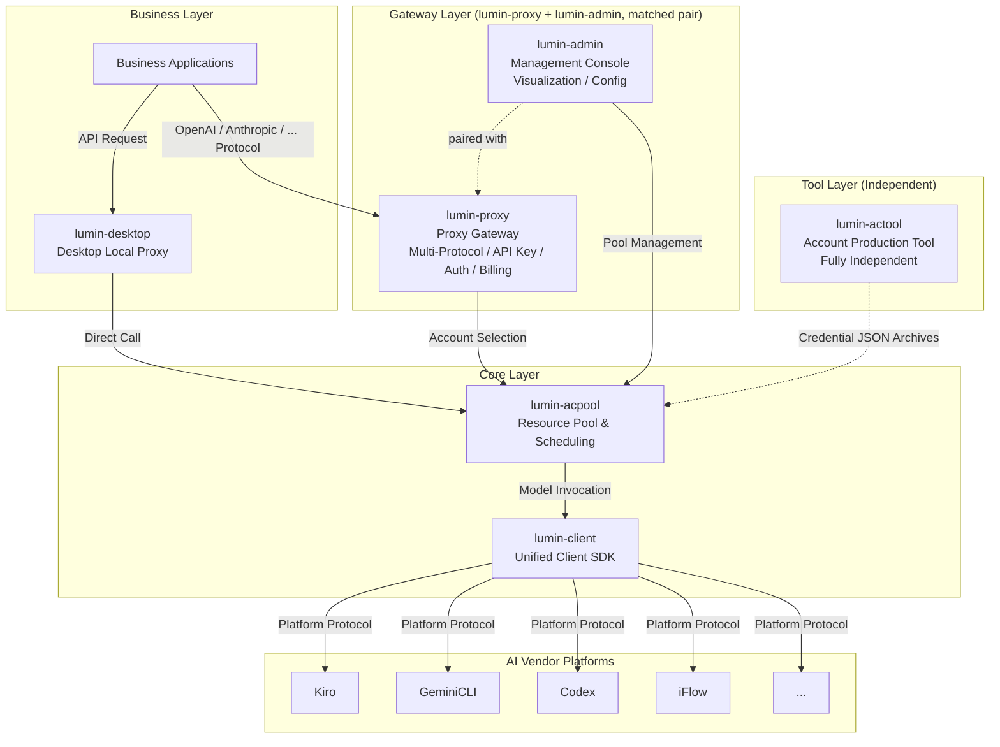
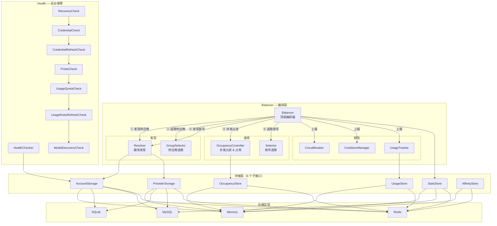
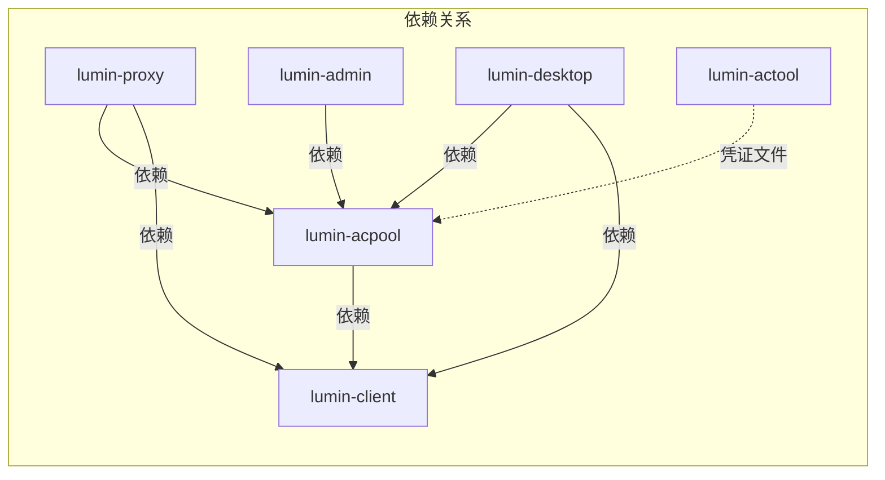
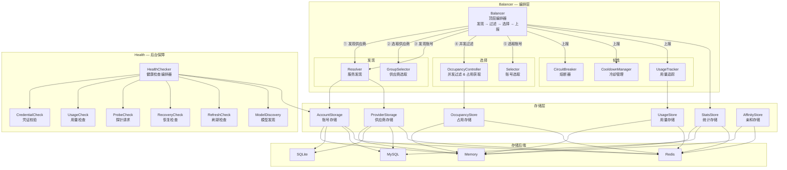

# ARCHITECTURE.md — lumin-acpool

lumin-acpool 是 LUMIN 生态的**账号池与调度引擎**，将多个 AI 平台账号聚合为资源池，通过负载均衡、熔断、冷却、健康检查实现高可用账号调度。以Lib库的形式对外提供能力

## LUMIN 生态架构



---

## 内部组件架构



### 子项目依赖关系



- **lumin-client** 是最底层的基础库，被其他所有子项目依赖。它定义了 `Provider` 接口、`Credential` 凭证接口、统一的 `Request`/`Response` 消息模型，以及各平台特有的协议转换器（Kiro、GeminiCLI、Codex、iFlow 等）。
- **lumin-acpool** 依赖 lumin-client，利用其 `Provider` 进行健康检查、用量规则获取，同时自身负责凭证管理与凭证校验，并在此基础上提供资源池调度能力。
- **lumin-proxy** 和 **lumin-admin** 是 **配套使用** 的一对组合：lumin-proxy 作为面向用户的代理网关，支持**多种主流模型协议**（OpenAI、Anthropic 等），用户可以按自己习惯的标准协议来调用模型；同时负责 API Key 管理、鉴权、计费、请求转发。lumin-admin 作为运维管理后台，负责可视化管理和系统配置。lumin-proxy 依赖 lumin-acpool 和 lumin-client；lumin-admin 依赖 lumin-acpool。
- **lumin-desktop** 依赖 lumin-acpool 和 lumin-client，实现独立的桌面级本地代理客户端应用。它与 lumin-proxy 的关系是 **二选一**：用户可以选择通过云端的 lumin-proxy 进行代理访问，也可以选择通过本地的 lumin-desktop 进行代理访问，两者在功能定位上互为替代方案。
- **lumin-actool** 是一个**完全独立**的工具，不依赖任何其他 LUMIN 子项目。它只负责生产账号凭证文件——产出多个凭证 JSON 文件的压缩包。这些凭证压缩包随后被导入 lumin-acpool，为资源池源源不断地供给可用账号。

---

#### lumin-acpool 项目架构



**Pick 核心流程**：

```
Balancer.Pick()
  │
  ├─ ① Resolver.ResolveProviders()          // 发现可用供应商列表
  ├─ ② GroupSelector.Select()                // 选取最佳供应商
  ├─ ③ Resolver.ResolveAccounts()            // 发现该供应商下的可用账号集
  ├─ ④ OccupancyController.FilterAvailable() // 过滤已达并发上限的账号
  ├─ ⑤ Selector.Select()                     // 从候选中选取最佳账号
  ├─ ⑥ OccupancyController.Acquire()         // 原子操作占用槽位
  └─ return PickResult

Balancer.ReportSuccess() / ReportFailure()
  │
  ├─ StatsStore                              // 更新调用统计
  ├─ UsageTracker.RecordUsage()              // 记录用量（触发冷却回调）
  ├─ CircuitBreaker.Record()                 // 熔断状态判定
  ├─ CooldownManager                         // 冷却管理
  └─ OccupancyController.Release()           // 释放占用槽位
```

#### 核心模块说明

| 模块 | 包路径 | 描述 |
|---|---|---|
| **Balancer** | `balancer/` | 顶层编排器，实现完整的"发现 → 过滤 → 选择 → 上报"流程，支持 Failover 故障转移和 Retry 重试 |
| **Resolver** | `resolver/` | 服务发现层，从存储中解析可用的供应商和账号；在 Pick 流程中最先执行，产出候选集合 |
| **GroupSelector** | `selector/` | 供应商级选择策略；内置：Priority、MostAvailable、GroupAffinity |
| **Selector** | `selector/` | 账号级选择策略；内置：RoundRobin、Weighted、Priority、LeastUsed、Affinity |
| **OccupancyController** | `balancer/occupancy/` | 单账号并发控制器（Balancer 子模块）；在选择前过滤已达并发上限的账号，选择后原子获取占用槽位；内置：Unlimited、FixedLimit、AdaptiveLimit |
| **CircuitBreaker** | `circuitbreaker/` | 基于连续失败次数的熔断器，支持根据账号用量规则动态计算熔断阈值 |
| **CooldownManager** | `cooldown/` | 限流触发的冷却管理器，支持可配置的冷却时长 |
| **UsageTracker** | `usagetracker/` | 本地+远端混合的用量追踪器，实现实时配额估算和主动配额耗尽过滤 |
| **HealthChecker** | `health/` | 后台健康保障编排器，支持依赖感知的执行顺序；内置检查项：Credential、Usage、Probe、Recovery、Refresh、ModelDiscovery |
| **Storage** | `storage/` | 可插拔的存储后端（Memory / SQLite / MySQL / Redis），覆盖账号、供应商、统计、用量、占用、亲和等数据 |

#### 账号状态生命周期

> 📖 **详细文档**: [account-lifecycle.md](../docs/design-docs/account-lifecycle.md)

```
                    ┌──────────────────────────────────────────┐
                    │                                          │
                    ▼                                          │
 ┌─────────────────────┐   触发限流    ┌──────────────┐       │
 │     Available       │ ────────────► │  CoolingDown  │───────┘
 │   （可被选取）       │               │ （自动恢复）   │  冷却到期
 └────────┬────────────┘               └──────────────┘
          │
          │ 连续失败
          ▼
 ┌──────────────┐    超时到期     ┌──────────────┐
 │ CircuitOpen   │ ──────────────► │  Half-Open    │──► Available（成功时）
 │ （排除选取）   │                │ （探测中）     │──► CircuitOpen（失败时）
 └──────────────┘                └──────────────┘

 其他终态：Expired → （刷新凭证）→ Available
           Invalidated（永久失效）
           Banned（平台封禁，需人工处理）
           Disabled（管理员手动禁用）
```

#### 选择策略

> 📖 **详细文档**: [add-strategy.md](../docs/design-docs/add-strategy.md)

**供应商级（GroupSelector）**：
- **MostAvailable** — 选择可用账号最多的供应商
- **GroupAffinity** — 将同一用户绑定到同一供应商（利用 system prompt caching）

**账号级（Selector）**：
- **RoundRobin** — 轮询，均匀分配请求到各账号
- **Weighted** — 按账号权重加权选择
- **Priority** — 优先选择最高优先级账号
- **LeastUsed** — 选择剩余配额最多的账号
- **Affinity** — 将同一用户绑定到同一账号（利用 LLM 上下文缓存）

---

#### 设计与实现关键约束
- **高稳定性** - :
    1. 必须保证选出的账号是可用的，坚决杜绝不可用的账号被选出来交付给业务层导致频繁的调用失败。关于账号可用性的判断标准可以参考**账号可用性标准**章节
    2. 确保在第一轮选号过程中成功率95%以上，剩下5%的成功率可以在指定的retry次数中来兜底
- **高性能** - 整个Pick流程要求高性能，任何场景下需要保证整个完整的选号处理时间必须小于100ms
- **可监控** - :
    1. 账号池当前的使用情况需要可监控，确保账号池中可用资源不足时候能及时知道需要补充多少新账号进来
    2. 每个账号的状态需要保证实时性

#### 账号可用性标准
1. 账号状态必须是`Available`
2. 交付的账号必须保证在并发控制要求以内
3. 需要根据`usagetracker`模块的信息，确保当前交付的账号没有被触发任何一条限流策略。

## 关联文档

| 文档 | 路径 | 内容 |
|------|------|------|
| 账号生命周期状态 | [account-lifecycle.md](account-lifecycle.md) | 账号生命周期中的状态管理说明 |
| 账号健康检查 | [health-check.md](health-check.md) | 账号可用性状态健康检查 |
| 存储层接口说明 | [storage.md](storage.md) | 存储层相关接口说明 |
| 选号流程说明 | [pick-flow.md](pick-flow.md) | 账号筛选处理流程 |
| 账号额度用量管理 | [usage-and-cooldown.md](usage-and-cooldown.md) | 用量追踪、限流管理、熔断管理 |
