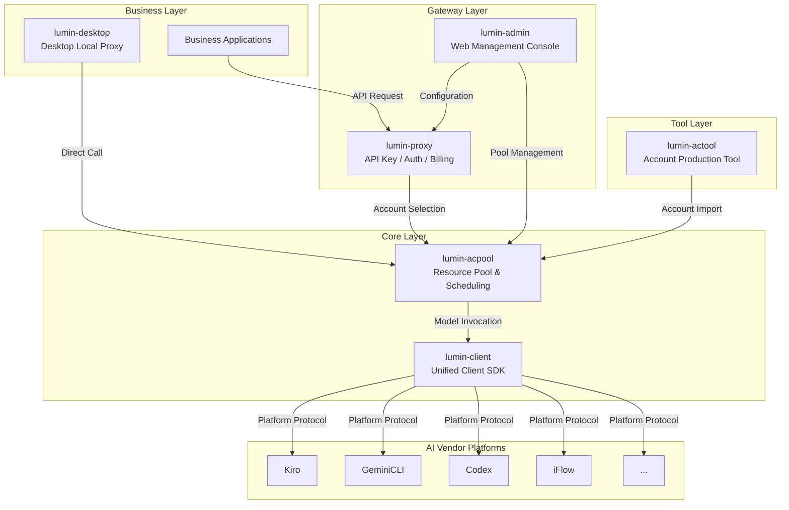
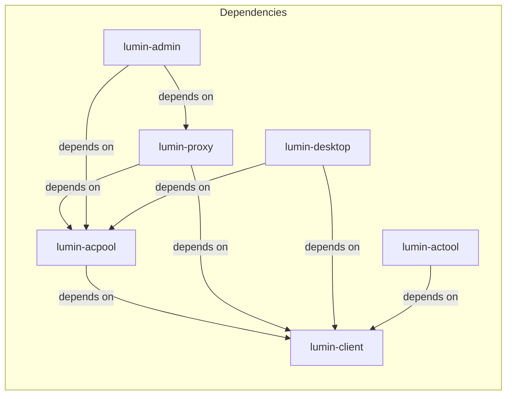
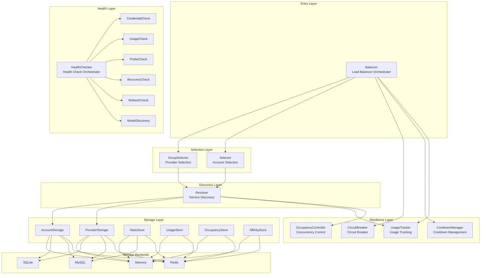

English | [中文](./docs/README_zh_CN.md)

## LUMIN

Light up AI routing. Hide the complexity.

---

### Introduction

**LUMIN** is a lightweight, unified AI proxy SDK ecosystem designed for multi-platform model invocation, account pool management, and intelligent routing.

It uniformly encapsulates and hides the protocol differences of various AI platforms such as **Kiro**, **GeminiCLI**, **Codex**, **iFlow**, etc., providing a consistent, concise, and stable calling interface. This allows upper-layer businesses to focus on their core logic without caring about the underlying platform details — perfectly embodying the core concept of **"Cloud Hiding"**: hide complexity at the bottom, leave simplicity for the business.

---

### LUMIN Ecosystem Overview

The LUMIN project consists of multiple sub-projects, each responsible for a specific domain, working together to form a complete AI proxy gateway system:

| Sub-Project | Role | Description |
|---|---|---|
| **lumin-client** | Client SDK | Core library for interfacing with various AI vendor platforms; provides unified request/response format conversion, credential management, and usage rule parsing |
| **lumin-acpool** | Resource Pool Service | Core library for unified resource management, intelligent scheduling, availability assurance, and account allocation |
| **lumin-proxy** | Proxy Service | Business-layer proxy service handling API key management, authentication, billing, and request forwarding |
| **lumin-admin** | Admin Web Service | Web-based management console for account pool visualization, business API key management, user management, billing policies, and token top-up |
| **lumin-actool** | Account Production Tool | CLI tool for generating and provisioning accounts across various AI vendor channels |
| **lumin-desktop** | Desktop Application | Local desktop proxy app built on lumin-client and lumin-acpool, providing standalone local proxy capabilities |

---

### Overall Architecture



---

### Sub-Project Relationships



- **lumin-client** is the foundational layer, depended on by all other sub-projects. It defines the `Provider` interface, `Credential` interface, unified `Request`/`Response` models, and platform-specific converters (Kiro, GeminiCLI, Codex, iFlow, etc.).
- **lumin-acpool** depends on lumin-client. It uses lumin-client's `Provider` for health checks, credential validation, and usage rule fetching while providing resource pool scheduling capabilities on top.
- **lumin-proxy** depends on both lumin-acpool and lumin-client, orchestrating business-layer requests through account selection and model invocation.
- **lumin-admin** depends on lumin-proxy and lumin-acpool, providing a web management interface for the entire system.
- **lumin-desktop** depends on lumin-acpool and lumin-client, implementing a standalone local AI proxy application.
- **lumin-actool** depends on lumin-client for account generation across multiple AI vendor channels.

---

### About This Project: lumin-acpool

**lumin-acpool** is the **resource pool and scheduling engine** of the LUMIN ecosystem. It serves as the core middleware between the business/proxy layer and the AI client SDK layer, responsible for:

- **Multi-account management**: CRUD operations for accounts and provider groups
- **Intelligent account selection**: Multi-strategy load balancing at both provider and account levels
- **Availability assurance**: Circuit breaker, cooldown, health check, and auto-recovery mechanisms
- **Usage tracking**: Real-time quota estimation combining local counting with remote calibration
- **Flexible storage backends**: Memory, SQLite, MySQL, and Redis storage implementations
- **Concurrency control**: Occupancy-based adaptive/fixed-limit concurrency management

#### lumin-acpool Internal Architecture



#### Core Modules

| Module | Description |
|---|---|
| **Balancer** | Top-level orchestrator implementing the complete "resolve → select → report" flow with failover and retry support |
| **Selector** | Two-level selection strategy: `GroupSelector` for provider-level and `Selector` for account-level; built-in strategies include Round Robin, Weighted, Priority, Least Used, Affinity |
| **Resolver** | Service discovery layer resolving available providers and accounts from storage, with pre-filtering of quota-exhausted accounts |
| **CircuitBreaker** | Consecutive-failure-based circuit breaker with dynamic threshold calculation based on account usage rules |
| **CooldownManager** | Rate-limit-triggered cooldown management with configurable cooldown duration |
| **UsageTracker** | Hybrid local+remote usage tracking for real-time quota estimation and proactive quota-exhaustion filtering |
| **HealthChecker** | Pluggable health check orchestrator with dependency-aware execution order; built-in checks: Credential, Usage, Probe, Recovery, Refresh, ModelDiscovery |
| **OccupancyController** | Per-account concurrency control with adaptive and fixed-limit strategies |
| **Storage** | Pluggable storage backends (Memory / SQLite / MySQL / Redis) for accounts, providers, stats, usage, occupancy, and affinity data |

#### Account Status Lifecycle

```
                    ┌──────────────────────────────────────────┐
                    │                                          │
                    ▼                                          │
 ┌─────────────────────┐   rate limit   ┌──────────────┐      │
 │     Available       │ ─────────────► │  CoolingDown  │──────┘
 │  (can be selected)  │                │ (auto-recover)│  cooldown expired
 └────────┬────────────┘                └──────────────┘
          │
          │ consecutive failures
          ▼
 ┌──────────────┐   timeout expired   ┌──────────────┐
 │ CircuitOpen   │ ──────────────────► │  Half-Open    │──► Available (on success)
 │ (excluded)    │                     │  (probe)      │──► CircuitOpen (on failure)
 └──────────────┘                     └──────────────┘

 Other terminal states: Expired → (refresh) → Available
                        Invalidated (permanent)
                        Banned (manual intervention)
                        Disabled (admin action)
```

#### Selection Strategies

**Provider-Level (GroupSelector)**:
- **MostAvailable** — Select the provider with the most available accounts
- **GroupAffinity** — Bind the same user to the same provider (for system prompt caching)

**Account-Level (Selector)**:
- **RoundRobin** — Even distribution across accounts
- **Weighted** — Selection based on account weight
- **Priority** — Select the highest priority account
- **LeastUsed** — Select the account with the most remaining quota
- **Affinity** — Bind the same user to the same account (for LLM context caching)

---

### Technical Features

- Written in pure **Golang**, high performance, low memory footprint
- Used as an **SDK library** — no intermediate service dependencies, simple deployment
- **Extensible architecture** — adding new AI platform support only requires an adapter layer
- Built-in **retry, circuit breaker, cooldown, health check** mechanisms
- Multiple storage backends: **Memory / SQLite / MySQL / Redis**
- Provides **CLI tool** for account and provider management
- Simple configuration, concise API design

---

### Project Positioning

**LUMIN = Cloud Hiding · Unified AI Proxy Gateway**

Let businesses focus only on logic, not platforms; let complexity be hidden, and calls be simpler.
